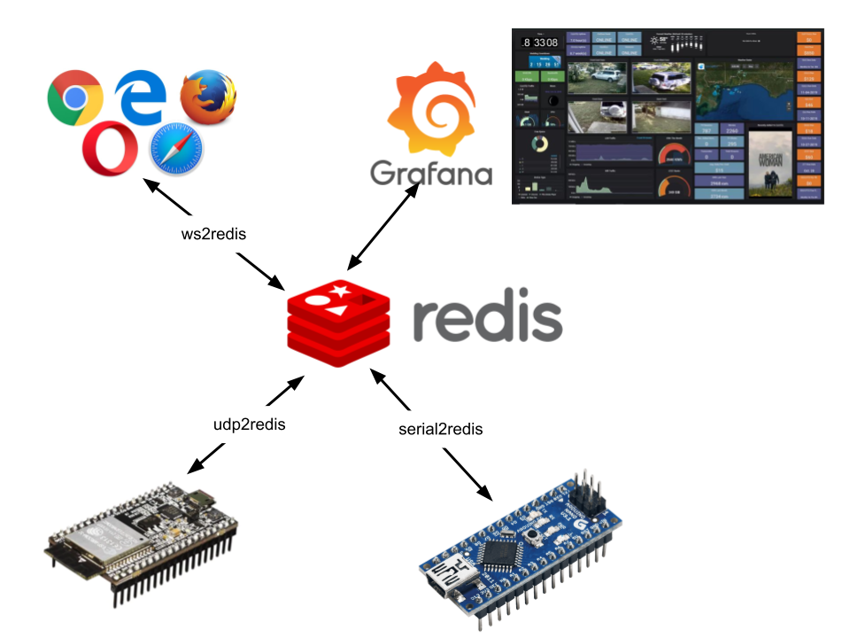

# TLDR;


Hit the ground running example !
Take you favorite Arduino and plug it in. 
```
#include <Arduino.h>
#include <ArduinoJson.h>

const char *addCmd[] = {"TS.ADD", "randomArduino", "*", "____","LABELS","property","random"};
DynamicJsonDocument doc(1024);

#include <Arduino.h>
void setup()
{
  Serial.begin(115200);
}
void loop()
{
  doc.clear();
  JsonArray array = doc.to<JsonArray>();
  copyArray( addCmd,array);
  doc[3] = std::to_string(random(0,100));
  serializeJson(doc, Serial);
  Serial.println();
  delay(100);                      // wait for a second
}
```

Setup PC
```
docker run redislabs/redistimeseries
docker run grafana/grafana
serial2redis  # using default ports /dev/ttyUSB0 on 115200 and Redis on localhost:6379
```
The example sends Redis commands via the serial port and updating a list of measurements with a random value between 0 and 100. The key is named _randomArduino_ and contains labels _property_ equals _random_. 

TS.ADD is understood by the Redis timeseries module. 

# Rationale
In my Robotic endeavours I was looking for a low latency Pub/sub mechanism with a high performant deployment on Raspberry Pi.
So Redis was an excellent candidat for this. When working with IoT you often require some basic DB and time-series collection, which came as an extra out of the box.
Looking at other features the stream structure is also something that will come handy for logging.

I've looked at other solutions like ROS and ROS2 , they are often very complex to deploy and use,  and are less widely installed and used.

A time-series viewing tool like Grafana works oput of the box with Redis.
Connecting a log Redis stream to ElasticSearch is a piece of cake.

In the chain sensors/actuators <-> Robot spine <->   Brain. 
The Redis broker will acvt as the central spine. The idea is also to connect the Brain and the Spine with an extra-low-latency layer, looking at Unix domain sockets or the shared-memory. 
# Serial to redis
The purpose is to create a bridge between small devices and microcontrollers to communicate with Redis. To easily compose requests and parse response the protocol is based on JSON serialization. 

The protocol is just a JSON form of the RESP3 (REdis Serialization Protocol ) and RESP2 protocol as this offers an access to all commands. The Hiredis library and his reply structure allow for a generic and recursive translation to JSON. Some nuances like Set are lost in translation however.

I expect also that the mobikle robot on Raspberry Pi can replicate it's data to a PC for data capture and control. 

# The protcol
The RESP protocol specifies that the request is an array of strings, so the JSON equivalent is the same
The RESP response can vary from a single integer till a highly complex structure of nested arrays and maps.

The JSON library ArduinoJson is used because of its wide range of deployemnts from Arduino to all kind of other server platforms. 

For IoT purpose it's often not needed to have responses to PUBLISH requests as these requests will be repeated continously. So a kind of QoS is possible 

Since the commands and properties that go over the line are ofthen the same there is also the tokenization possible of the commands.
In the protocol this can help tyo reduce the communication overhead.

Example : ["PUBLISH","src/node/system/time", 17676876] becomes [578587,465435,17676876]
or [231,"system/time",17676876]
# Communication layer
The current  serial2redis supports several communication layers :
- UDP with each datagram a request and response ( no CRC or further framing needed )
- Serial UART with CR/LF framing without CRC ( Arduino )
- Serial UART with PPP framing and CRC. ( micro-controller actuators )
- TBD : ESP-NOW bridge ( SWITCH= ESP_NOW-1 <-> )
# Serial to redis Protocol
The serial or udp endpoint is sending frames that contain a JSON array and receives as a response JSON Variant ( can be any variuable integer,bool,double,string,array or object )

The RESP protocol specifies that the request is an array of strings, so the JSON equivalent is the same
The RESP response can vary from a single integer till a highly complex structure of nested arrays and maps.

The JSON library ArduinoJson is used because of its wide range of deployemnts from Arduino to all kind of other server platforms. 
```
["PUBLISH","X","3.5"]
["PSUBSCRIBE","dst/myNode/*"]
["XADD","logs","*","node",myNode,"message",message]
// in C++ code to send 
auto array = doc.to<JsonArray>();
array.add("XADD");
array.add("str:pos");
array.add("*");
array.add("lon");
array.add("50.9543");
array.add("lat");
array.add("4.9563");
std::string cmd;
serializeJson(doc,cmd);
["TS.ADD","ts:temperature","*","34.5"]
["SET","x","5665"]
["HELLO","3"]
```
can return 
```
["pmessage","dst/myNode/*","key","value"]
```

First parameter :
- 0 : no reply
- 1 : ACK
- 2 : full redisreply
- other numbers are read as tokens with FNV hash
````
[-1,"src/myNode/object/property","3.54"]
[-2,767,"3.54"]
[-3,"object/property","3.54"]
````

SerialSession.read >> pppFrameExtract >> crcCheck >> bytesToJson >> Redis.request
Redis.response >> jsonToBytes >> crcAdd >> pppFrameEnvelope >> SerialSession.write
SerialSession.connected >> Redis.doConnect

UdpListener.read >> UdpClient >> bytesToJson >> Redis.request
Redis.response >> jsonToBytes >> UdpClient.send 

microClient --> send PING Sys::micros() until PONG
--> PSUBSCRIBE dst/node/*
LOOP    --> PUBLISH dst/node/sys/loopback 9079  // current time in usec
        --> recv "pmessage",...
        --> PUBLISH src/node/sys/latency 76

JsonArray.copyArray 

